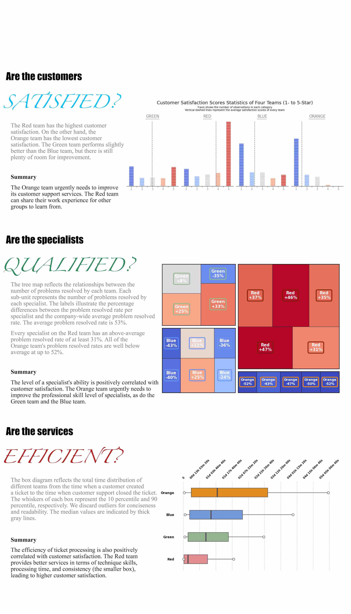

# Data Visualization - Infographic

## Description

The goal of the project is to discuss how efficient the company's customer support is. We realize this from THREE aspects.

- __Are the customers satisfied?__

> First, as the old saying goes, the customer is always right. Therefore, we visualize customer feedback for individual teams. After understanding how the customers feel about the four teams, we try to find the reasons behind different levels of satisfaction. This leads us to the next two analyses.

- __Are the specialists qualified?__

> Secondly, one main concern of the customers is whether their problems have been resolved. This can be used to evaluate the professional quality of our specialists. As a result, we then visualize the problem resolved rate of the individual team and each specialist belongs to the team.

- __Are the services efficient?__

> Finally, we investigate the efficiency of customer support. The customer support team should address customers' problems promptly. Service efficiency is also directly related to customer satisfaction.

## Infographic

## References

- The squarify plot function is slightly modified based on the Squarify library:

    https://github.com/laserson/squarify/tree/master

- How to combine multiple matplotlib figures together?

    https://stackoverflow.com/questions/70083434/combine-two-matplotlib-figures-side-by-side-high-quality

- How to create subplot grid with different sizes?

    https://stackoverflow.com/questions/73584258/add-subplot-how-to-make-grid-with-two-rows-with-different-number-of-columns
